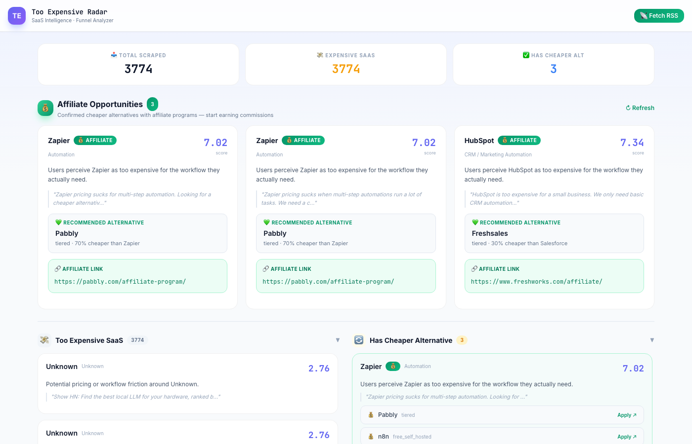
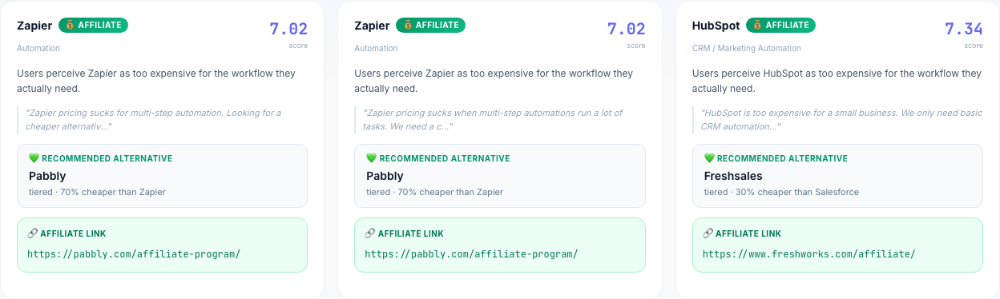

# Too Expensive Radar

**AI-Native SaaS Replacement Intelligence — Find the next billion-dollar opportunity in "too expensive" complaints.**

[](https://github.com/fendouai/TooExpensiveRadar/actions/workflows/ci.yml)
[](https://www.python.org/)
[](LICENSE)

---

## What is this?

Every day, millions of users complain online that their software is **too expensive**, **overkill**, or **bloated**. They want alternatives. Too Expensive Radar listens to these signals and transforms them into **actionable AI-native SaaS replacement opportunities**.

### The Core Insight

> **The biggest alpha in AI startups isn't "what AI can do" — it's identifying which expensive SaaS are legacy artifacts of complex workflows.**

Users constantly signal what they need:
- "HubSpot is too expensive for basic CRM"
- "Jira is overkill for our 5-person team"
- "Zapier pricing sucks for multi-step automations"

**Too Expensive Radar** captures these signals and scores them for opportunity potential.

---

## Features

- **83 RSS Data Sources** — Hacker News, Reddit communities, TechCrunch, AI blogs, startup forums, and more
- **3-Layer Funnel** — Raw signals → Expensive SaaS → Affiliate Opportunities (with direct application links)
- **One-Click RSS Fetch** — Fetch all 83 feeds and analyze instantly from the UI
- **Dual Analysis Engine** — Rule-based (no API key needed) or LLM-powered (Claude/MiniMax/GPT)
- **6-Dimension Scoring** — Pricing Pain, Feature Bloat, SMB Overkill, AI Compression, Feasibility, Workflow Simplicity
- **Opportunity Feed** — Ranked disruption scores with evidence links
- **Background Collection** — Celery + Redis task queue for continuous monitoring
- **Multi-Channel Alerts** — Telegram, Email, DingTalk, Feishu, WeCom, ntfy, Bark, Webhooks
- **Flexible Scheduling** — Always on, morning/evening, office hours, or night owl presets

---

## Quick Start

### Option 1: Docker (Recommended)

```bash
# Clone the repository
git clone https://github.com/fendouai/TooExpensiveRadar.git
cd TooExpensiveRadar

# Start everything with one command
docker-compose up
```

Open [http://localhost:8000](http://localhost:8000)

### Option 2: Manual Setup

```bash
# Clone the repository
git clone https://github.com/fendouai/TooExpensiveRadar.git
cd TooExpensiveRadar

# Create virtual environment
python -m venv .venv
source .venv/bin/activate  # On Windows: .venv\Scripts\activate

# Install dependencies
pip install -e ".[test]"

# Start Redis (required for background tasks)
# macOS: brew install redis && redis-server
# Ubuntu: sudo apt install redis-server

# Start the app
uvicorn app.main:app --reload --port 8000
```

Open [http://localhost:8000](http://localhost:8000)

### Configuration

Copy `config.yaml.example` to `config.yaml` and add your API keys:

```yaml
llm:
  minimax:
    api_key: "your-minimax-api-key"
    base_url: "https://api.minimax.chat/v1"
    model: "MiniMax-M2.7"
```

---

## Screenshots

### Funnel Overview — Affiliate Opportunities (Priority #1)


**This is the most important view.** It shows the 3-layer funnel:

1. **📥 Total Scraped** — All signals collected from RSS feeds
2. **💸 Expensive SaaS** — Signals where users complained about pricing/bloat/overkill
3. **✅ Has Cheaper Alternative** — Opportunities with identified alternatives

The **green hero section** at the top shows **Affiliate Opportunities** — confirmed cheaper alternatives with active affiliate programs. These are the most actionable leads: you know exactly which expensive SaaS users want to replace, and you have the direct affiliate link to start earning commissions.

### Stats Bar


### Affiliate Opportunities Detail


Each affiliate card shows:
- The expensive SaaS causing complaints (e.g., Zapier, HubSpot)
- User quote / evidence
- Recommended cheaper alternative
- **Direct affiliate application link** (green box)

---

## How It Works

```
RSS Feeds (83 sources: Tech News + Reddit communities)
         ↓
1. TOO EXPENSIVE? (Rule-based / LLM detection)
         ↓
2. HAS CHEAPER ALT? (Pre-built DB + Web Search + LLM inference)
         ↓
3. HAS AFFILIATE? (Affiliate DB lookup)
         ↓
   💰 Affiliate Opportunity — affiliate URL ready to apply
```

**Priority order:** If there's an affiliate link, it goes to the top. The funnel narrows from thousands of raw signals down to the few that are both **actionable** (cheap alt exists) and **monetizable** (affiliate program available).

---

## Project Structure

```
TooExpensiveRadar/
├── app/
│   ├── main.py              # FastAPI app + endpoints
│   ├── analyzer.py         # Rule-based + LLM analysis
│   ├── models.py           # SQLModel database schema
│   ├── database.py         # Database connections
│   ├── scheduler.py        # Timeline scheduling
│   ├── llm/                # LLM clients (Claude, OpenAI, MiniMax)
│   ├── scrapers/           # Data source collectors
│   │   └── rss_fetcher.py # RSS/Atom/JSON feed parser
│   ├── notification/        # Multi-channel alerts
│   │   └── senders.py     # Telegram, Email, DingTalk, etc.
│   └── tasks/              # Celery background tasks
├── tests/                  # pytest tests
├── .github/workflows/      # GitHub Actions CI/CD
├── docker-compose.yml      # Docker setup
└── pyproject.toml         # Project metadata
```

---

## API Endpoints

| Method | Endpoint | Description |
|--------|----------|-------------|
| `GET` | `/api/stats` | Dashboard statistics |
| `GET` | `/api/funnel/status` | Funnel counts (L1/L2/L3) |
| `GET` | `/api/funnel/data` | Full funnel data with affiliate URLs |
| `GET` | `/api/raw-signals` | Raw RSS signals |
| `GET` | `/api/opportunities` | List opportunities (filterable by score/software/category) |
| `POST` | `/api/ingest/text` | Ingest a single complaint |
| `POST` | `/api/ingest/csv` | Batch CSV import |
| `POST` | `/api/ingest/url` | Extract from URL via LLM |
| `GET` | `/api/datasources` | List configured data sources |
| `POST` | `/api/rss/fetch-all` | Fetch all 83 RSS feeds + analyze (one-click) |
| `POST` | `/api/rss/collect` | Trigger RSS collection from DB config |
| `GET/POST` | `/api/rss/feeds` | Manage RSS feeds |
| `GET/PUT` | `/api/llm/configs/{provider}` | Configure LLM providers |
| `POST` | `/api/notifications/send` | Send test notification |
| `GET` | `/api/scheduler/status` | Scheduler status |
| `GET` | `/api/tasks` | Background task status |

Full API docs: [http://localhost:8000/docs](http://localhost:8000/docs)

---

## Scoring System

| Score | Weight | What It Measures |
|-------|--------|------------------|
| **Pricing Pain** | 30% | How much users complain about cost |
| **AI Compression** | 22% | How much AI can simplify the workflow |
| **Feature Bloat** | 18% | How many unused features exist |
| **SMB Overkill** | 16% | Whether SMBs are tortured by enterprise software |
| **Feasibility** | 14% | How easy the replacement is to build |

---

## Data Sources (83 Feeds)

### Tech News
Hacker News, TechCrunch, The Verge, Ars Technica, Wired, BBC Tech, Engadget

### AI & ML
NVIDIA Blog, AWS ML Blog, Microsoft AI Blog, Google AI Blog, Google DeepMind, OpenAI Blog, Anthropic Blog

### Community (Reddit)
r/SaaS, r/startups, r/entrepreneur, r/smallbusiness, r/webdev, r/indiehackers, r/artificial, r/MachineLearning, r/ChatGPT, r/programming, r/devops, and 20+ more

### More
Product Hunt, Indie Hackers, VentureBeat AI, CoinDesk, The Hacker News, and more.

---

## Contributing

Contributions are welcome! Please read our guidelines before submitting PRs.

1. Fork the repository
2. Create a feature branch (`git checkout -b feature/amazing-feature`)
3. Run tests (`pytest`)
4. Commit your changes (`git commit -m 'Add amazing feature'`)
5. Push to the branch (`git push origin feature/amazing-feature`)
6. Open a Pull Request

---

## License

MIT License — see [LICENSE](LICENSE) for details.

---

## Roadmap

- [ ] PostgreSQL + pgvector for semantic clustering
- [ ] Automated weekly newsletter generation
- [ ] Price gap analysis (existing vs. possible pricing)
- [ ] Multi-tenant support
- [ ] API rate limiting and authentication
- [ ] Deployment to major cloud platforms
